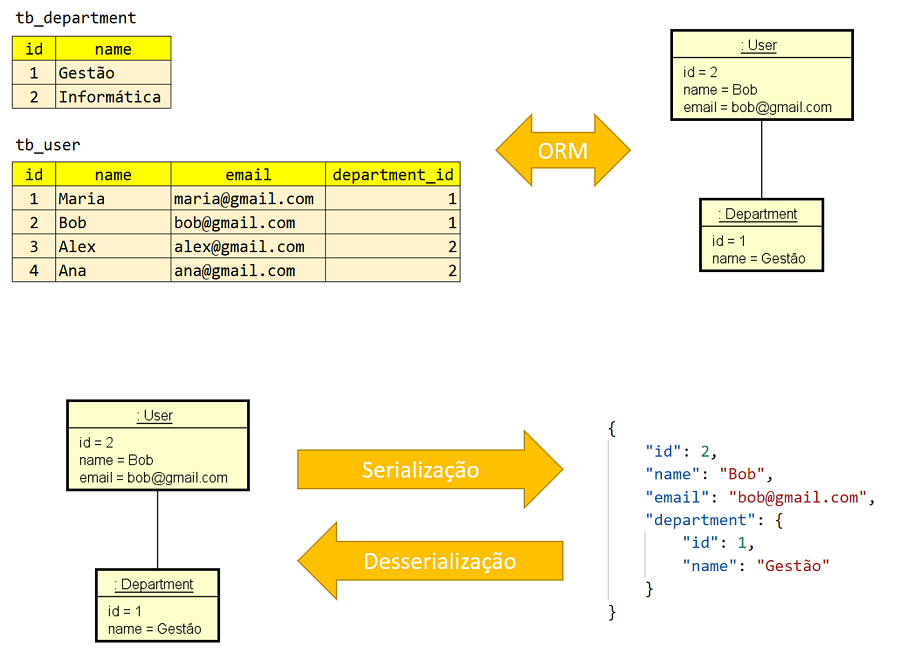

# first-spring-project

### Visão geral do projeto

Baseado nas aulas do professor Nélio Alves da DevSuperior foi desenvolvido um pequeno sistema (API REST) de usuários e departamentos, com os seguintes casos de uso:

- Buscar todos usuários
- Buscar um usuário pelo seu id
- Inserir um novo usuário

### Desenvolvimento moderno: relacional -> objeto -> json

### Passos do projeto

- Implementação do modelo de domínio
- Mapeamento objeto-relacional com JPA
- Configuração do banco de dados H2
- Criação de endpoints da API REST

